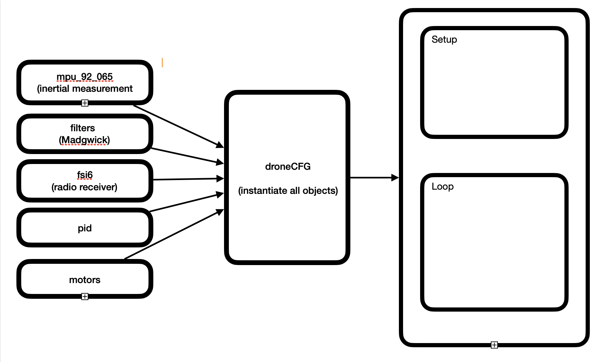

Component list for the autoleveling drone below.

 **HGLRC 60A 6S V1 ESC BLS 2-6S 4in1 M3, Supports DShot600/300/150 Digital Protocols x 1**
 **Readytosky RS2205 2300KV Brushless Motor CW/CCW 3-4S RC Motors for FPV Racing Drone FPV Multicopter x 4**
 **PJRC Teensy 4.0 x 1**
 **HiLetgo 3pcs GY-521 MPU-6050 MPU6050 3 Axis Accelerometer Gyroscope Module 6 DOF 6-axis Accelerometer x 1**
 **Usmile 250 mm 3K Carbon Fiber FPV Quadcopter Frame x 1**
 **LiPo Battery Pack 35C 2200mAh 3S 11.1V x 1**
 **FLYSKY FS-i6X 10CH 2.4GHz RC Transmitter Controller with FS-iA6B Receiver x 1**
 **MP1584EN 5pcs Mini 5V Buck Converter Board - 5-30V to 5V, 1.8A x 1**

Software Circuit Diagram:ToDo

**Project Discussion:**

Building a quadcopter requires certain basic elements.  Naturally it requires motors and propellers for thrust, a battery supply to power said motors.  Since the motors used for this project are brushless DC motors, an electronic speed controller(ESC) is also required.  A microcontroller or flight controller is required to provide data signals to the speed controller.  In this case, the microcontroller is a Teensy 4.0.  The Teensy 4.0 has to interface with a sensor/sensors and also a receiver so that it can receive remote control commands from the drone pilot.  

The sensor in this case is an MPU6050 6 axis IMU, while the receiver is an fsi6 receiver.

The Teensy 4.0 communicates with the IMU via SPI protocol at 1000Khz.  It also receives information from the remote control using a serial interface and PPM modulation. Pulse-position modulation (PPM) is a technique where analog message values are encoded by varying the position of fixed-width pulses within specific time slots relative to a reference clock.)

What signal will the Teensy send to the speed controller?  The ESC used is a 4 in 1 controller where there are four ESC's mounted on the same printed circuit board.  Each esc has its own serial input from the microcontroller.  The protocol used to transmit the information is OneShot125.  This protocol sends pwm signals at a frequency of 2000hz (500 microsecond period), with a duty cycle ranging from 125 microseconds to 250 microseconds representing the minimum and maximum speeds respectively.

Onto addressing the propeller spinning direction.  This drone follows the traditional propeller orientation and direction.  The front two propellers spin inward, while the rear two spin outward.  Meaning the leading edge of the front right propeller is right-handed rotating counter-clockwise and the front left is left-handed rotating clockwise.  The leading edge of the right-rear propeller is left handed rotating clockwise and the rear-left propeller is right-handed rotating counter-clockwise.
Each propeller can achieve lift because each propeller spins in the corresponding direction of its leading edge.  Consequently the torque generated by each propeller is opposite to its direction of spin.  (It should also be noted that the motors are not configured to be bi-directional.)

The two preceding facts determine how lift/elevation, yaw, pitch and roll are achieved.  It will be useful to imagine the drone is sectioned into a front half and rear half, as well as left half and right half.  

How is elevation controlled?  Elevation is controlled by increasing or decreasing propeller speed so that the lift/thrust of the propellers is greater than the weight of the drone itself.  The combined lift from each propeller will raise the drone elevation, while the torque forces are cancelled between the left and the right half and also between the front and the rear, maintaining a level orientation.  

How is yaw controlled?  In order to yaw the vehicle clockwise the propeller velocities of the front-right and the rear-left should be greater than that of the front-left and the rear-right. And in order to yaw the vehicle counter-clockwise the propeller velocity of the front-left and rear-right must be greater than those of the front-right and rear-left.  And in order to maintain level the thrust from all four motors must be able to overcome the weight of the drone itself.

How is pitch controlled?  Pitch control requires a delta between the force via thrust/rpm propellers on the front and the propellers on the rear.  In order to pitch forward so that the front of the drone is lower than the rear of the drone, the thrust in the front must be less than the thrust in the rear, with the front propellers having equal thrust and the rear propellers having equal thrust as well.  If one is wondering why there is no yaw associated with a pitch inclination -- it is because the yaw torque on the front half and rear half opposes each other.  The torque from the left motor is canceled out by the torque from the right motor.

Roll control is similar.  In order to achieve a roll inclination there must be a delta in thrust between the left half of the drone and the right half of the drone.  That is to say the propellers on the left side have the same thrust while the propellers on the right side must have a thrust value of lower or greater value.  If one is wondering why there is no yaw associated with a roll inclination -- it is because the yaw torque on the left half and right half opposes each other.  The torque from the front motor is canceled out by the torque from the rear motor.

Elevation torque has been achieved.  

